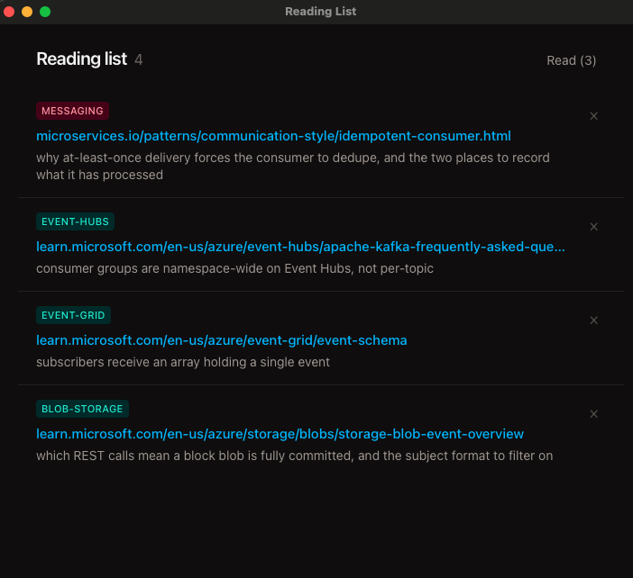

# Reading List

While using claude I regularly get it to pull links to official docs and patterns and things when I am unfamiliar with some aspects of it's suggestions.

I started saving links to a .md file via a skill but found it annoying to manage.

As a process it's pretty helpful. Especially when working with unfamiliar tech, which I have had to do a lot lately in a new role.

So I vibe coded this little app - Don't judge me - which lets claude manage a .yaml file of links I need to read.

Now Claude appends every doc it cites to one file, and a small Mac app shows what is still unread.



Each link is saved with one line on what that doc *answers*, so later you know why it is there. Click a link to open it. Click `×` to file it under read.

Nothing is uploaded anywhere. The list is one file on your Mac, `~/.claude/reading-list.yaml`.

## Install

Three steps, about five minutes. You need a Mac and Claude Code.

### 1. Install the app

1. Download `Reading.List_<version>_universal.dmg` from [Releases](https://github.com/JeromeGill/reading-list/releases).
2. Open it, drag **Reading List** into your Applications folder.
3. The app is unsigned, so the first open is blocked. **Right-click** it in Applications → **Open** → **Open**. Only needed once; after that it opens normally, including from Spotlight.

Works on macOS 10.15 and later, both Apple Silicon and Intel.

### 2. Install the skill

The skill is what teaches Claude to save links. Open Claude Code anywhere and run these three lines:

```
/plugin marketplace add JeromeGill/reading-list
/plugin install reading-list@jeromegill-plugins
/reload-plugins
```

No clone, no build. Confirm the install when it asks.

### 3. Tell Claude to actually use it

Claude only uses a skill when it judges it relevant, which is inconsistent. Making it reliable takes one paste.

Open `~/.claude/CLAUDE.md` (create it if it does not exist) and add:

```markdown
# Reading List

When you suggest a doc, spec, or blog post worth reading, invoke the
`reading-list` skill. It owns the file, the schema, and the dedupe rules.

- The list lives at `~/.claude/reading-list.yaml`. A desktop app reads and writes it, so don't hand-edit it — go through the skill.
- Only links you have actually fetched. Never write a URL from memory.
- Don't re-add a link already listed; say it's already there and which list it's on.
```

That file is loaded into every Claude Code session, so this works in all your projects.

### Check it worked

In Claude Code, say:

> find me a doc on postgres index types and add it to my reading list

Then open Reading List. The link should be there. If the app was already open, click its window — it refreshes when it regains focus.

## If something goes wrong

| What you see | Fix |
| --- | --- |
| macOS says the app "cannot be opened" | You double-clicked it. Right-click → **Open** → **Open** instead. |
| Claude ignores the reading list | Step 3 was skipped, or `~/.claude/CLAUDE.md` has a typo in the path. You can also just say "add that to my reading list" to force it. |
| `Marketplace not found` | Run `/plugin marketplace update jeromegill-plugins`, then retry the install. |
| App is empty but Claude said it saved a link | Click the app window to refocus it. Still empty: open `~/.claude/reading-list.yaml` and check the link is under `unread`. |

## What the file looks like

`~/.claude/reading-list.yaml` is plain text you can read and back up:

```yaml
unread:
  - link: https://microservices.io/patterns/communication-style/idempotent-consumer.html
    topic: messaging
    context: why at-least-once delivery forces the consumer to dedupe, and the two places to record what it has processed
read:
  - link: https://docs.nestjs.com/recipes/cqrs
    topic: nestjs
    context: when CommandBus and CommandHandler earn their keep versus a plain service
    readAt: 2026-07-30
```

The app owns both lists and writes `readAt` when you mark something read. Claude only ever adds to the top of `unread`, and never adds a link twice. Do not hand-edit it while the app is open.

## Docs

- [Development](docs/development.md) — build from source, run the dev window, cut a release
- [How it fits together](docs/architecture.md) — the two halves, the shared file, the repo layout
